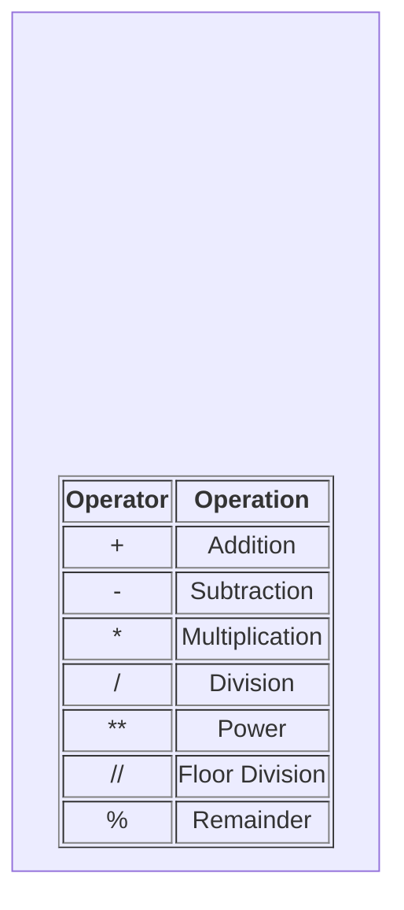
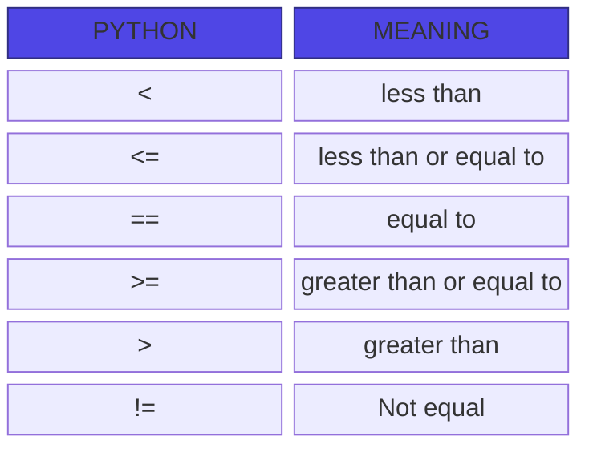

# Reserved words .

You cannot use reserved words as variable name / identifiers
- False: Represents the boollean false value.
- None: Represents the absence of a value or a null value.
- True: Represents the boolean true value.
- and: A logical operator that returns True if both statements are true.
- as: Used to create an alias when importing a module or in a with statement.
- assert: Used for debugging; tests if a condition is true and triggers an error if it is not
- async: Used to declare an asynchronous function or method.
- await: Pauses the execution of an asynchronous function until an awaited task completes.
- break: Immediately exits the current loop (for or while).
- class: Used to define a new user defined class (a blueprint for creating objects).
- continue: Skips the rest of the current loop iteration and moves directly to the next one.
- def: Used to define a new function.
- del: Deletes a reference to an object, such as a variable, list item, or dictionary key.
- elif: Short for "else if"; used in conditional statements to check multipel conditions sequentially.
- else: Defines a block of code to run if the if (or elif) condition is false, or if a loop completes without hitting a break.
- except: Catches and handles exceptions (errors) that occur within a try block.
- finally: Defines a block of code that will execute no matter what, even if an exception is raised in a try block.
- for: Used to create a loop that iterates over a sequence (like a list, tuple, or string).

- from: Used alongside import to import specific attributes or functions from a module.

- global: Declares that a variable inside a function refers to a variable defined at the top level of the script, rather than a local variable.

- if: Starts a conditional statement to execute code only if a specific condition evaluates to true.

- import: Used to bring an entire external module or library into your current script.

- in: Checks if a specific value is present within a sequence (like a list or string); also used in for loops.

- is: Tests for object identity, checking if two variables refer to the exact same object in memory.

- lambda: Used to create a small, anonymous (unnamed) function on a single line.

- nonlocal: Declares that a variable in a nested function refers to a variable in the nearest enclosing scope (excluding the global scope).

- not: A logical operator that reverses the boolean value of a statement.

- or: A logical operator that returns True if at least one of the statements is true.

- pass: A null statement that does nothing; used as a placeholder when syntax requires a statement but you have no code to execute yet.

- raise: Manually triggers an exception or error.

- return: Exits a function and optionally passes a value back to the caller.

- try: Starts a block of code to be tested for potential errors during execution.

- while: Creates a loop that continues executing its block of code as long as a specified condition remains true.

- with: Simplifies exception handling and resource management, commonly used for automatically closing files after opening them.

- yield: Pauses a function and returns a value like return, but saves the state to allow the function to be resumed later (creating a generator).  
 
 ## Condititonal steps
 ```python
 x = 5 
 if x < 10:
    print("smaller")
if x > 20:
    print("bigger")

print("Finis")
```
## Repeated Steps
- loops (repeated steps) have iteration variable that change each time through a loop.
```python
n = 5
while n>0:
    print(n)

print("blastoff!")
```
## Variables
- A variables is a named place in the memory where a programmer can store data and later retrive the data using the variable "name"
- Programmers get to choose the names of the variables
- You can change the contents of a variable in a later statement
```python
x=5
y=6
print(x+y)
```
## Numerical Expressions

### Operator Precedence Rules
Highest precedence rule to lowest precedence rule:
- Parentheses are always respected
- Exponentiation (raise to a power)
- Multiplication, Division, Floor Division, and Remainder
- Addition and Subtraction
- Left to right

## type function 
- In python variables, literals, and constants have a "type"
- python knows the difference between an integer number and a string 
- python knows what "type" everything is 
- some operations are prohibited 
- you cannot "add 1 " to a string 
- we can ask python what type something is by using the type() function
```python
type(eee)
>>> <class'str'>

type(1)
>>> <class'int'>
```
## several types of Numbers
- Numbers have two main types
- integers are whole numbers:
  -14, -2 ,0 ,1,100, 401233
- Floating point Numbers have decimla parts: -2.5, 0.0, 98.6, 14.0
- There are other number types -they are variations on float and integer
## Type conversions
- when you put an integer and floating point in an expression, the integer is implicitly converted to a float
- You can contol this with the build-iin function int() and float()
## Division
- Dividing integers and floating point numbers using the / operator always produces a floating point result.
```python
print(10/2)
>>> 5.0
print(99.0./100.0)
>>> 0.99

```
## Floor Division
- Division using // operator always produces a result that is the floor of the division-meaninig the result is rounded down to the nearest integer value.
```python
print(10//2)
>>> 5.0
print(9//2)
>>> 4
```
## string Conversions
- you can also use int() and float() ato convert between strings and integers
- you will get an error if the string does not contain numeric characters
 
 ## User Input
- we can instruct python to pause and read data from the user using the input() function 
- The input() fuction returns a string
``` python
name=input("who are you?")
print("welcome", name)
```
## Comments in Python
- Anything after a # is ignored by python 
- why comment?
 - - Describe what is going to happen in a sequence of code
 - - Document who wrote the code or other ancilary information
 - - Turn off a line of code - perhaps temporarily
 
 ```python
 # Get the name of the file and open it
 name= input("Enter file:")
 handle = open(name, "r")

 # Count word Frequency
 counts=dict()
 for line in handle:
    words = line.split()
    for word in words:
        counts[word] = counts.get(word,0) + 1

# Find the most common word
bigcount = None
bigword = None
for word,count in counts.items():
    if bigcount in none or count > bigcount:
        bigword = word
        bigcount = count


# All done
print(bigword, bigcount)
```
# Conditional Execution
- Boolean expressions ask a qusetion and produce a YES or NO result which we use to control program flow
- Boolean expressions using comparison operators evaluate to TRUE / FALSE or YES/NO
- Comparison operators look at variables but do not change the variables

## Indentation 
Visualizing the Block (Indentation)
In Python, you do not "close" an if statement with an endif or a closing bracket . The block is visually and logically defined entirely by whitespace (typically 4 spaces).

- Code aligned at the same indentation level belongs to the same block.

- Moving back to the left (dedenting) signals the end of that specific decision block.

To see exactly how a multi-way and nested block evaluates path-by-path, you can step through this interactive visualization:

## One-Way Decisions
- An if statement with no alternative. If the condition is True, the indented block executes. If False, the program skips it entirely.
```python
x = 10
if x > 5:
    print("x is greater than 5") 
# Execution continues here regardless

```
## Two-Way Decisions (with else)
- An if-else statement provides two strict paths. If the condition is True, the first block executes. If False, the else block executes. One of the two paths is guaranteed to run.
``` python
age = 16
if age >= 18:
    print("Eligible to vote")
else:
    print("Not eligible to vote")
```
## Multi-Way Decisions (elif)
- Used when you have more than two mutually exclusive conditions. Python checks each condition from top to bottom. As soon as one evaluates to True, its block executes, and the rest of the chain is skipped.
```python
score = 85
if score >= 90:
    print("Grade: A")
elif score >= 80:     # Checks this only if the first 'if' is False
    print("Grade: B")
elif score >= 70:     # Checks this only if the 'elif' above is False
    print("Grade: C")
else:                 # Catch-all if everything above is False
    print("Grade: F")

```

## Nested Decisions
- Placing an if statement inside another if statement. This is used when a secondary condition should only be checked if the primary condition is already met.
```python
user_logged_in = True
is_admin = False

if user_logged_in:               # Primary decision
    print("Welcome back!")
    
    if is_admin:                 # Nested decision (indented further)
        print("Admin Dashboard Accessed")
    else:
        print("Standard User Dashboard")
```
